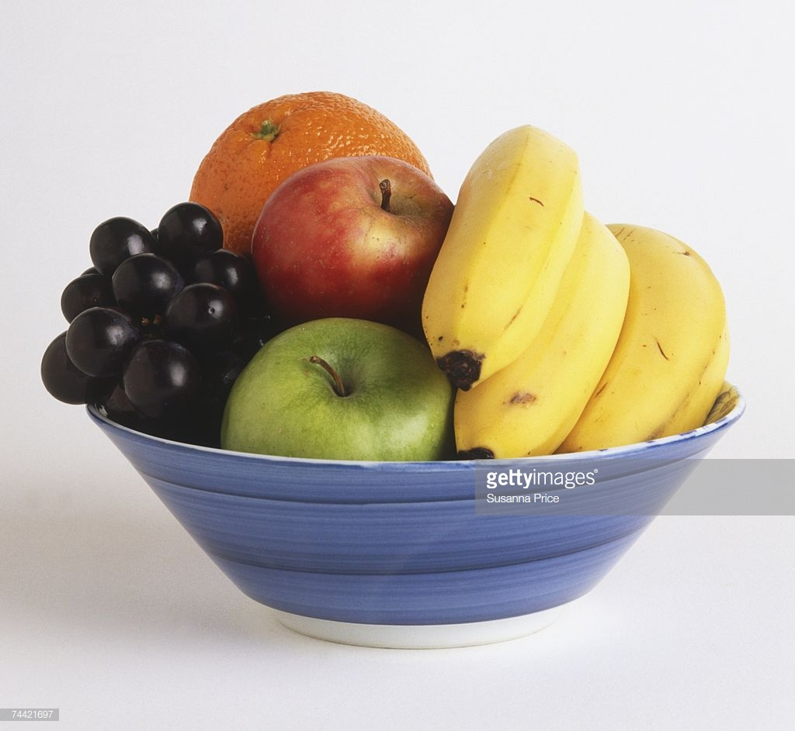
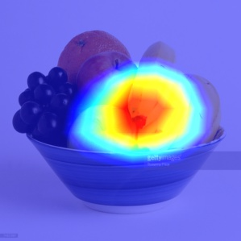

## Grad-CAM
If you want to briefly know about grad-cam, 
[please refer to this link.](https://github.com/NCC-AI/Study/blob/master/articles/Grad-CAM.md)  
Input Imgae  

Grad-CAM output (Banana is highligted!)  
