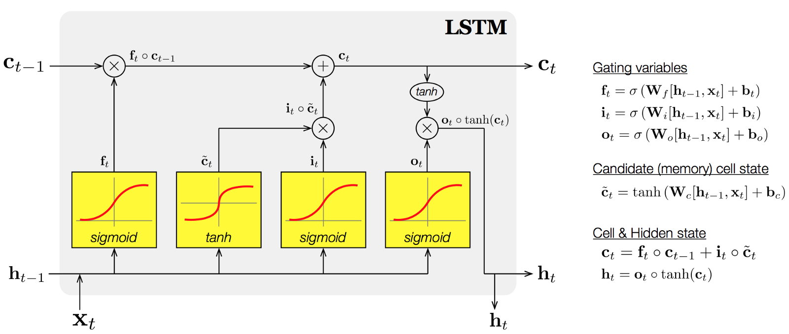

# Long Short Term Memory (LSTM)

- Long Short Term Memory(LSTM) is one of the Techniques of time series analysis.
- LSTM is based on Recurrent Neural Network

This model predict the function: = sin(2x)exp(x/10)

## Reference
- [LSTM Tutorial](https://machinelearningmastery.com/time-series-prediction-lstm-recurrent-neural-networks-python-keras/)
- [Keras Code](https://qiita.com/sasayabaku/items/b7872a3b8acc7d6261bf)